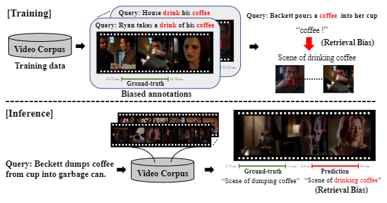
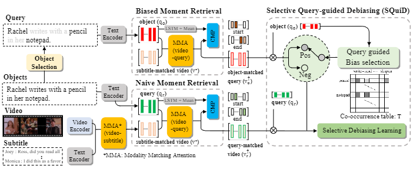

# SQuiDNet: Selective Query-guided Debiasing Network for Video Corpus Moment Retrieval

We are providing the Code for ECCV 2022 paper "Selective Query-guided Debiasing for Video Corpus Moment Retrieval"

Author: "Sunjae Yoon, Ji Woo Hong, Eunseop Yoon, Dahyun Kim, Junyoeng Kim, Hee Suk Yoon and Chang D. Yoo

## Task: Video Corpus Moment Retrieval
Video moment retrieval (VMR) aims to localize target moments in untrimmed videos pertinent to given textual query. Existing retrieval systems tend to rely on retrieval bias as a shortcut and thus, fail to sufficiently learn multi-modal interactions between query and video.

SQuiDNet is proposed to debiasing in video moment retrieval via conjugating retrieval bias in either positive or negative way.

<p lign="center">
	
</P>

## SQuiDNet Overview
SQuiDNet is composed of 3 modules: (a) BMR which reveals biased retrieval, (b) NMR which performs accurate retrieval, (c) SQuiD which removes bad biases from accurate retrieval of NMR subject to the meaning of query.

<p lign="center">
	
</P>

## Implementation
Our results and further studies will also be updated soon!
1. Clone the repositery

```
git clone https://github.com/dbstjswo505/SQuiDNet.git
cd SQuiDNet
```

2. Prepare the environment
```
conda env create -f squid.yml
conda activate squid
```


3. Input Features Download

Download [tvr_feature_dataset](https://drive.google.com/file/d/1AfmhROqBPlT49jfU0gyyv2Eyl9XNHkCp/view?usp=sharing), which should be located in the main folder SQuiDNet with the directory like below:

```
data
├── bmr
│   ├── bmr_prd_test_public_tvr
│   ├── bmr_prd_train_tvr
│   └── bmr_prd_val_tvr
├── sub_query_feature
│   ├── roberta_query
│   └── roberta_sub
├── video_feature
│   └── resnet_slowfast_1.5
├── text_data_ref
└── coocurrence_table
```
It is also available to download visual features (ResNet, SlowFast) obtained from [HERO](https://github.com/linjieli222/HERO/) authors and text features (subtitle and query, from fine-tuned RoBERTa) obtained from [XML](https://github.com/jayleicn/TVRetrieval) authors.
Feature extraction is available via understanding and running the code details: [visual feature extraction](https://github.com/linjieli222/HERO_Video_Feature_Extractor), [text feature extraction](https://github.com/jayleicn/TVRetrieval/tree/master/utils/text_feature).
The noun and predicate for coocurrence table are extracted using the code: [noun and predicate extraction](https://github.com/BigRedT/info-ground).

4. SQuiDNet Training

```
bash scripts/train.sh
```
`train.sh` is performed with our defined hyperparameters, see the details in the code and is possible to modified experiement for more better performances including hyperparameter tunning.

5. SQuiDNet Inference.

```
bash scripts/inference.sh
```
`inference.sh` is also performed with our defined hyperparameters and also hold the details in the code. Current settings are fixed on all the tasks including VCMR, SVMR and VR.

5. Build Coocurrence Table
```
python mk_table.py
```
To design own your coocurrence table, you can adjust the 'cctable.json' file by running the code `./data/coocurrence_table/mk_table.py`, which updates the `cctable.json` file.

## Acknowledgement
This code is implemented on top of following contributions:
[TVRetrieval](https://github.com/jayleicn/TVRetrieval),
[HERO](https://github.com/linjieli222/HERO/),
[HuggingFace](https://github.com/huggingface/transformers),
[Info-ground](https://github.com/BigRedT/info-ground),
[NetVLAD](https://github.com/Relja/netvlad)
[VLANet](https://arxiv.org/abs/2008.10238)
[CONQUER](https://github.com/houzhijian/CONQUER)
[MMT](https://github.com/gabeur/mmt),
[MME](https://github.com/antoine77340/Mixture-of-Embedding-Experts).
We thank the authors for open-sourcing these great projects and papers!

## Citation
If you find this code useful for your research, please cite our paper:
```
@inproceedings{syoon2022SQuiDNet,
  title={SQuiDNet: Selective Query-guided Debiasing Network for Video Corpus Moment Retrieval},
  author={Sunjae Yoon, Ji Woo Hong, Eunseop Yoon, Dahyun Kim, Juneyeong Kim, Hee Suk Yoon and Chang D. Yoo},
  booktitle={Proceedings of the European Conference on Computer Vision},
  year={2022}
}
```

